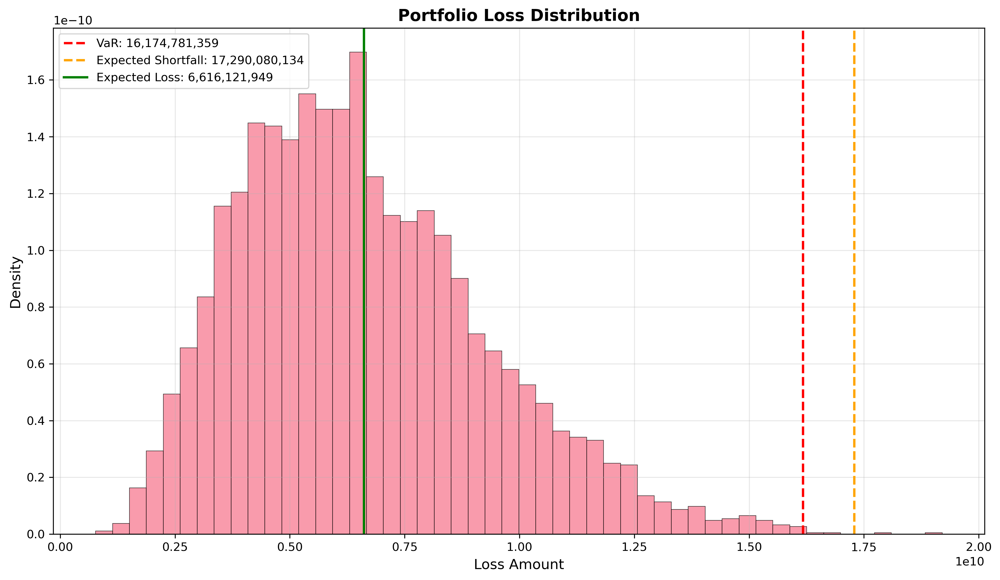

# Credit Risk Modeling & IFRS 9 ECL Pipeline


## 📌 Executive Summary
This project implements an end-to-end **Credit Risk Management Pipeline** using the Lending Club dataset (2007-2018). It demonstrates the full lifecycle of credit risk modeling, from data ingestion and feature engineering to model development (PD), calibration, and regulatory capital calculation (IFRS 9 Expected Credit Loss).

The system is designed to simulate a real-world banking environment where models drive both credit decisions and financial reporting.

## 🚀 Key Features
- **Robust Data Pipeline:** Automated cleaning, outlier detection, and logical imputation for financial data.
- **Advanced Feature Engineering:** Created behavioral features, interaction terms, and handled missing data patterns.
- **Machine Learning Model:** Developed an **XGBoost** classifier optimized for AUC and calibrated using **Isotonic Regression** to ensure accurate probability outputs.
- **Risk Metrics Engine:**
  - **PD (Probability of Default):** Calibrated model output.
  - **LGD (Loss Given Default):** Beta distribution modeling.
  - **EAD (Exposure at Default):** Credit conversion factor simulation.
- **IFRS 9 Compliance:** Automated staging logic (Stage 1/2/3) and Lifetime ECL calculation.

## 📊 Model Performance
The model was evaluated on a strict out-of-time holdout set.

| Metric | Score | Interpretation |
|--------|-------|----------------|
| **AUC** | **0.703** | Good discrimination capability between good and bad loans. |
| **Calibration** | **Isotonic** | Probabilities are aligned with observed default rates (Brier Score optimized). |

### Top Risk Drivers
1. **Interest Rate:** Higher rates correlate strongly with default risk.
2. **Debt-to-Income (DTI):** Key indicator of borrower leverage.
3. **FICO Score:** (Derived/Proxy) Historical creditworthiness.

## 💰 IFRS 9 & Portfolio Risk Analysis
*Note: The following figures are based on a stress-test simulation using hypothetical exposure amounts ($50k-$500k) to demonstrate the engine's capability to handle large commercial-sized portfolios.*

### Portfolio Health (Staging)
Loans are classified into three stages based on credit quality deterioration (SICR):

| Stage | Count | Definition | ECL Calculation |
|-------|-------|------------|-----------------|
| **Stage 1** | 236,825 | Performing Loans | 12-Month ECL |
| **Stage 2** | 166,839 | Underperforming (Significant Increase in Risk) | Lifetime ECL |
| **Stage 3** | 61 | Non-Performing / Impaired | Lifetime ECL |

### Financial Impact
- **Total Portfolio Expected Loss (ECL):** `$6,670,395,133.02`
- **Risk Context:** The high proportion of Stage 2 loans indicates a simulated scenario where a significant portion of the portfolio has experienced credit deterioration since origination, triggering higher capital provisions.



## 🛠️ Technical Architecture
```
├── data/                   # Raw and processed datasets
├── notebooks/              # Jupyter notebooks for analysis
│   ├── 01_data_exploration.ipynb
│   └── 02_modelling_and_risk_analysis.ipynb
├── src/                    # Production-grade source code
│   ├── data_loader.py      # Recursive data ingestion
│   ├── preprocessing.py    # Cleaning & Transformation
│   ├── feature_engineering.py
│   ├── models.py           # XGBoost & Logistic Regression wrappers
│   ├── risk_metrics.py     # Basel II/III & IFRS 9 Calculators
│   └── visualization.py    # Plotting utilities
└── tests/                  # Unit tests
```

## 💻 Usage
1. **Install Dependencies:**
   ```bash
   pip install -r requirements.txt
   ```
2. **Run the Pipeline:**
   Open `notebooks/02_modelling_and_risk_analysis.ipynb` to execute the full training and analysis workflow.

## 📝 License
This project is for educational and portfolio demonstration purposes.
